# GitHub Copilot で出来る事

**AIペアプログラミングツールの活用と機能検証**

---

# 📖 目次

1. **VSCode 編**
2. **Web ブラウザ編**
3. **その他の活用場面**

---

## 💻 VSCode 編

### 🔧 基本機能
- VSCode の拡張機能として簡単に導入・使用可能
- リアルタイムでのコード補完とコード生成

---

## 💬 GitHub Copilot Chat

### 🎯 主要機能
- **対話型インターフェース** によるソース修正・資料作成
- **ファイル全体の分析** ・リファクタリング提案
- **修正差分の可視化** とプレビュー機能

---

## 📊 資料作成・出力機能

### 📝 作成機能
- **Markdown 形式** での資料作成
- **Marp 拡張機能** と連携したプレゼンテーション作成

### 📤 出力機能
- **PDF・PPTX 形式** での出力（※出力した PPTX は編集不可）
- **HTML 形式** でのWebブラウザ表示・共有
- **PNG・JPEG 形式** での画像ファイル出力
- **スライド形式** のレイアウト自動調整

---

## 🎨 Marp とは？

### 📝 Marp の概要
- **Markdown Presentation Ecosystem**
- **Markdown ファイル** から **スライド** を生成するツール
- **VSCode 拡張機能** として利用可能

### ⚡ 主な特徴
- **シンプルな記述** でプロフェッショナルなスライド作成
- **テーマ・スタイル** の柔軟なカスタマイズ
- **リアルタイムプレビュー** で即座に確認

---

## 🎬 資料作成機能のデモ結果

### 📝 基本的な要求への対応
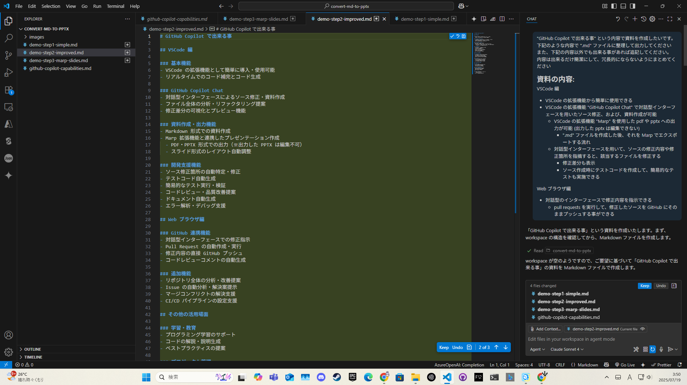

**ドキュメント作成要求への迅速対応**

---

## 📋 資料作成結果のプレビュー

### 🔍 作成結果のプレビュー画面
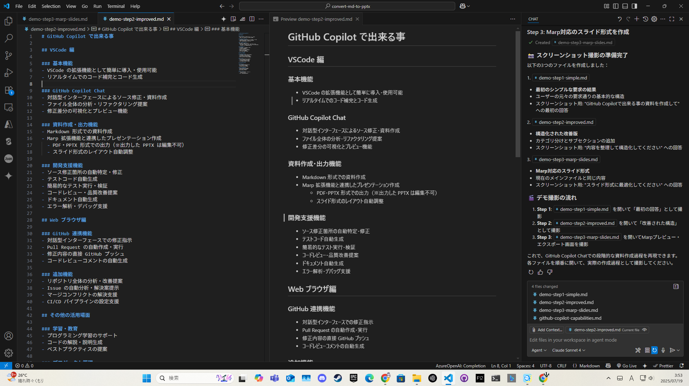

**生成された資料の確認・プレビュー**

---

## 📊 Marp連携デモ結果

### 🎨 スライド形式での出力
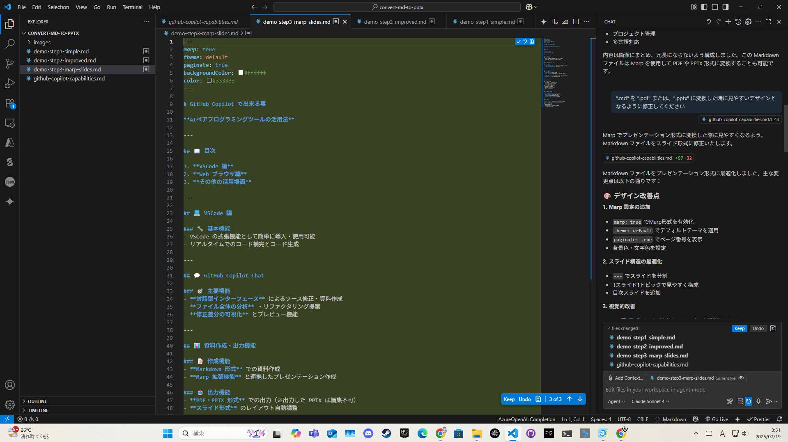

**Markdown から美しいプレゼンテーション作成**

---

## 🖼️ Marpスライドのプレビュー

### 📱 スライドプレビュー画面
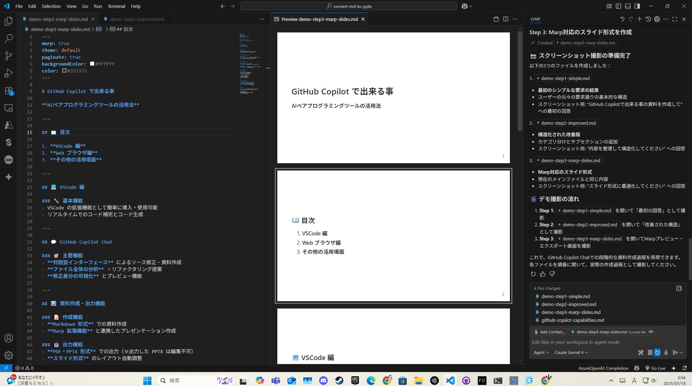

**作成されたスライドの表示確認**

---

## 🛠 開発支援機能

### 🔍 分析・修正
- ソース修正箇所の自動特定・修正
- コードレビュー・品質改善提案
- エラー解析・デバッグ支援

### 🧪 テスト・ドキュメント
- テストコード自動生成
- 簡易的なテスト実行・検証
- ドキュメント自動生成

---

## 🎬 開発支援機能のデモ結果

### 📋 サンプルプログラム作成
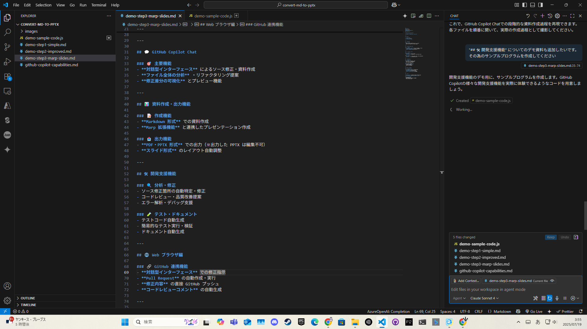

**段階的なプログラム開発支援**

---

## ✅ プログラム完成・品質向上

### 🎯 最終的な完成形
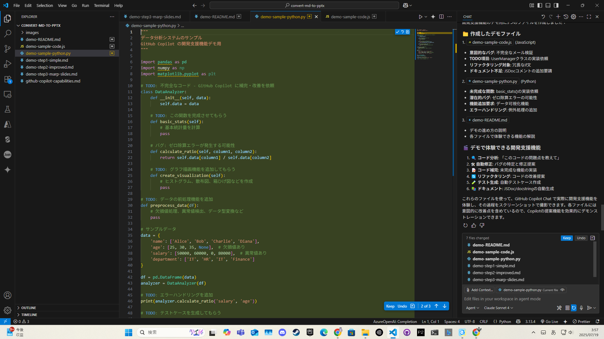

**問題解決とコード品質改善**

---

## 💻 コード分析・補完・リファクタリング

### 🔧 分析結果
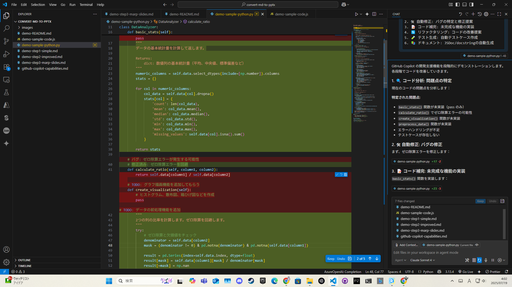

**リアルタイムでのコード改善提案**

---

## 🧪 テスト機能のデモ結果

### 🔧 自動テスト生成
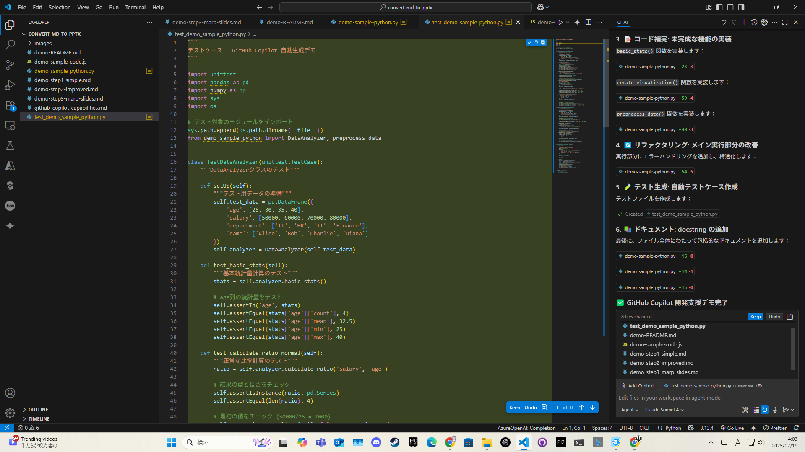

**テストコード自動生成機能**

---

## 🧪 テスト実行・結果出力

### ⚡ テスト実施

**自動実行による検証**

---

## 📋 テスト結果の確認

### 📊 テスト結果表示
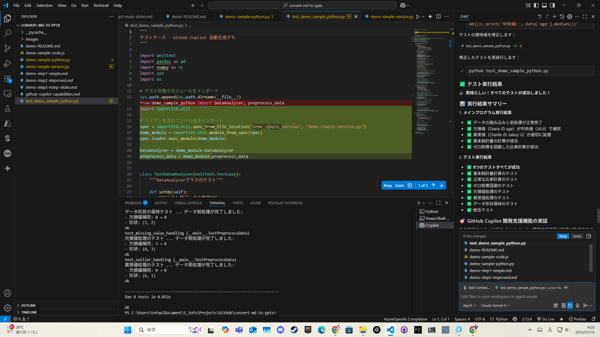

**実行結果の詳細確認**

---

## 📊 テスト結果の可視化

### 📈 Excel形式での結果出力
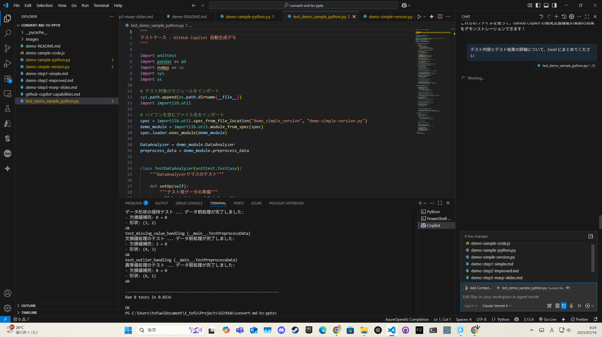

**結果の構造化・レポート生成**

---

## 📋 テスト結果の可視化

### 📊 テスト結果詳細確認
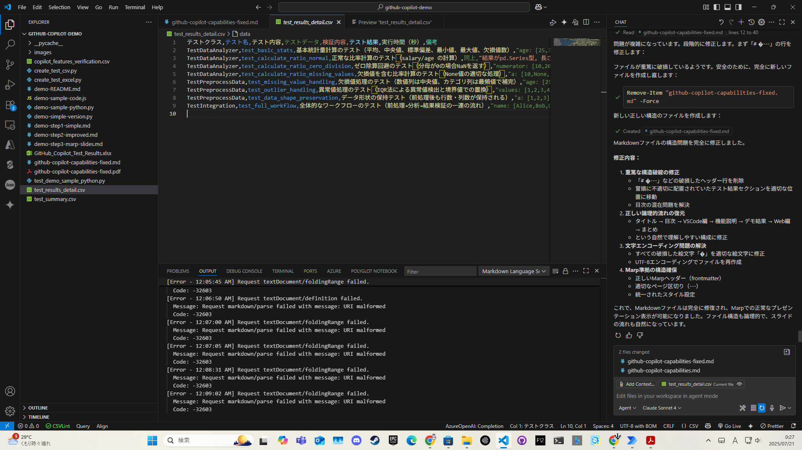

**実行結果についての資料作成指示**

---

## 🌐 Web ブラウザ編

### 🔗 GitHub 連携機能
- **対話型インターフェース** での修正指示
- **Pull Request** の自動作成・実行
- **修正内容** の直接 GitHub プッシュ
- **コードレビューコメント** の自動生成

---

## 🔧 Web ブラウザ - 追加機能

### 📈 分析・管理
- **リポジトリ全体** の分析・改善提案
- **Issue** の自動分析・解決案提示

### ⚙️ 運用支援
- **マージコンフリクト** の解決支援
- **CI/CD パイプライン** の設定支援

---

## 🎓 その他の活用場面

### 📋 プロジェクト管理
- README ファイルの自動生成
- API ドキュメントの作成
- 技術仕様書の作成支援

---

## 🌍 多言語対応

### 💻 プログラミング言語
- **複数プログラミング言語** への対応
- **言語間のコード変換**

### 🗣 自然言語
- **技術文書の翻訳**
- **多言語での説明生成**

---

## 💰 GitHub Copilot 料金体系

### 💳 個人向けプラン
- **GitHub Copilot Individual**: **$10/月** または **$100/年**
- **30日間無料トライアル** 利用可能

---

## 👥 おすすめするユーザー

### 🚀 こんな方に特におすすめ
- **開発効率を向上させたい** プログラマー・エンジニア
- **ドキュメント作成を効率化** したい全人類

---

## 🔮 今後の展望

### 📊 プレゼンテーション機能の改善
- **Marp の PPTX エクスポート制限**
  - 現在: エクスポートファイルが **画像として保存** され編集不可
  - 課題: PowerPoint での **後編集ができない**

### 🎯 改善目標
- **Marp 以外の方法** で PPTX 出力機能を実装
    
### 💡 技術的なアプローチ
- **Office API** を活用した直接生成

---

## ✨ まとめ

**GitHub Copilot** は開発からドキュメント作成まで
**幅広く活用できる強力なAIアシスタント**

### 🎯 主なメリット
- **開発効率の大幅向上**
- **高品質なコード・ドキュメント生成**
- **学習・教育支援の充実**

### 🏆 デモで実証された機能
- **リアルタイムコード補完・品質改善**
- **自動テスト生成・実行・結果出力**
- **Markdown→スライド変換**
